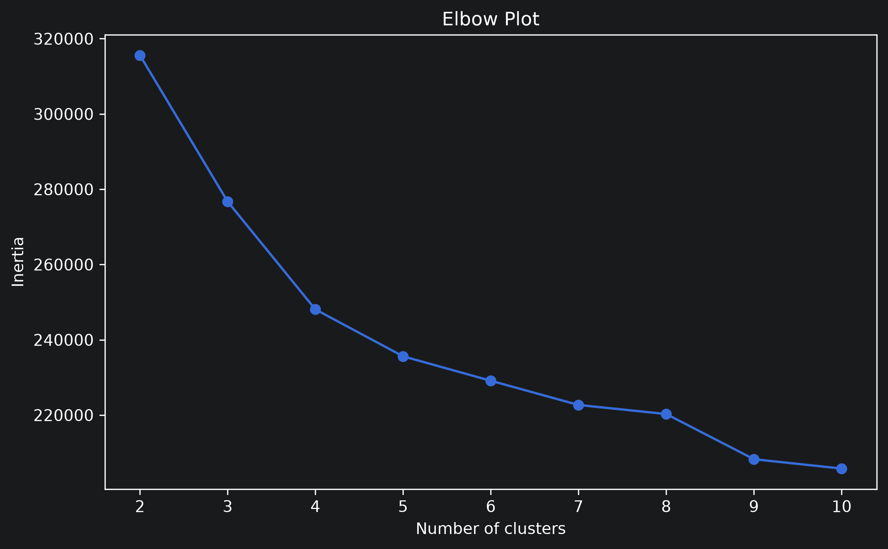
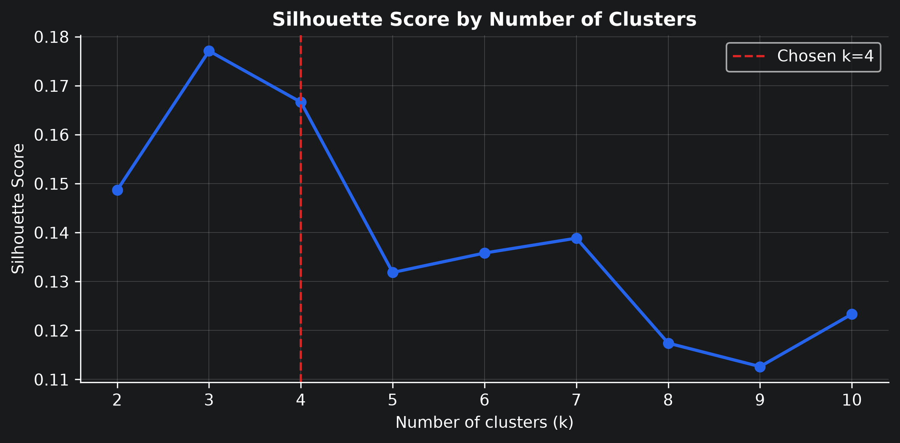
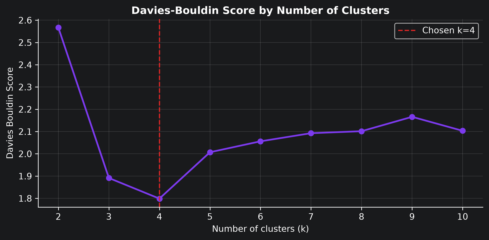

# Police Incidents Clustering

An unsupervised machine learning pipeline designed to isolate, compress, and cluster high-dimensional public safety logs from the Center for Policing Equity (CPE). By leveraging **Truncated SVD** and **MiniBatchKMeans**, this project identifies four distinct operational signatures within ~315k incident records to help municipal leaders optimize resource allocation, route crisis incidents to healthcare teams, and audit public safety equity.

## Goal

The goal is to reduce the complexity of a large policing-incident dataset, identify homogeneous groups of incidents, and create visualizations and descriptive cluster summaries that can support interpretation.

## Dataset

The analysis uses the Center for Policing Equity Kaggle dataset:

https://www.kaggle.com/datasets/center-for-policing-equity/data-science-for-good

```text
This repository follows a rigorous, step-by-step data engineering and modeling pipeline:

1. **Data Discovery & Ingestion (`db_explore.ipynb`):** Programmatically parsed raw multi-department Kaggle data to isolate a high-fidelity, complete target tracking baseline under directory `Dept_49-00081`.
2. **Data Engineering & Feature Processing (`main.ipynb`):** * Dropped uninformative index IDs and high-cardinality text rows (e.g., explicit street addresses) to eliminate spatial noise.
   * Preserved exact coordinate vectors (`LOCATION_LONGITUDE`, `LOCATION_LATITUDE`) for geographic analysis.
   * Encoded categorical attributes (`INCIDENT_REASON`, `DISPOSITION`) into memory-efficient **Sparse One-Hot Matrices**.
3. **Dimensionality Reduction (`main.ipynb`):** Projected the high-dimensional sparse feature space down to 50 continuous components via **Truncated SVD**, bypassing the curse of dimensionality while preserving structural variance.
4. **Empirical Clustering Optimization (`main.ipynb`):** Ran an iterative hyperparameter tuning loop ($K = 2$ to $10$) evaluating **Inertia**, **Silhouette Scores**, and the **Davies-Bouldin Index** to mathematically prove **4 clusters** as the optimal configuration.
```

## Method summary

1. Load and inspect the selected incident-report file.
2. Group variables into date/time, geographic, incident-type, outcome, and ID-like fields.
3. Clean text fields and convert latitude/longitude to numeric values.
4. Transform date/time fields into model-friendly features.
5. Engineer weekend, time-period, and rounded geographic-bin features.
6. Exclude record identifiers and full street addresses from clustering.
7. Use sparse one-hot encoding for categorical variables and scaling for numeric variables.
8. Apply TruncatedSVD for dimensionality reduction.
9. Use MiniBatch K-Means for clustering.
10. Export cluster summaries and report-ready figures.

## How to run

Install dependencies:

```bash
pip install -r requirements.txt
```

Running Pipeline:

1. Clone the repo
2. Execute db_explore.ipynb to review the source file filtering logic. (Feel free to choose any dataset of the given list, but don't forget to write the path to it in that case!)
3. Run main.ipynb to execute the full data engineering pipeline, train the clustering model, and generate report-ready visualization assets inside outputs/figures/

```bash
jupyter main.ipynb
```

## Outputs

The pipeline creates an `outputs/` folder containing:

```text
column_summary.csv
feature_summary.csv
policing_equity_features.csv
svd_explained_variance.csv
svd_components.csv
cluster_evaluation.csv
cluster_counts.csv
numeric_cluster_summary.csv
final_cluster_summary_for_report.csv
policing_equity_clustered.csv
svd_2d_coordinates.csv
figures/
```

>[!NOTE]
> I decided to not push to the repo some outputs like ```policing_equity_clustered.csv``` since those there are quite big files.
> Also, for the same reason I decided to not push the chosen dataset.

Recommended report figures:

```text
outputs/figures/svd_clusters_2d.png
outputs/figures/geographic_cluster_distribution.png
outputs/figures/incidents_per_cluster.png
outputs/figures/incident_reason_by_cluster.png
outputs/figures/disposition_by_cluster.png
```

## Key Visualizations

## elobow_plot.png: Demonstrates a distinct inflection point flattening out right at K=4



## silhouette_by_k.png & davies_bouldin_by_k.png: Confirms optimal cluster cohesion and maximum separation boundaries at 4 clusters



##



## geographic_cluster_distribution.png: Maps out the clear spatial polarization of traffic enforcement along highways versus crisis management clustered in dense urban centers


## Authors

The project was done by [Anri :sunglasses:](https://github.com/anristepanian)
