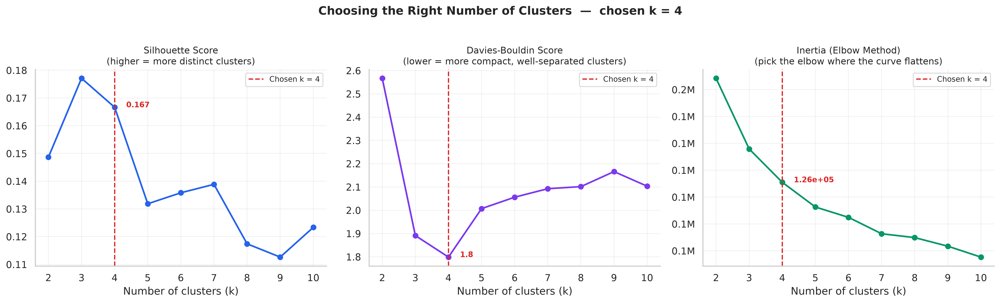
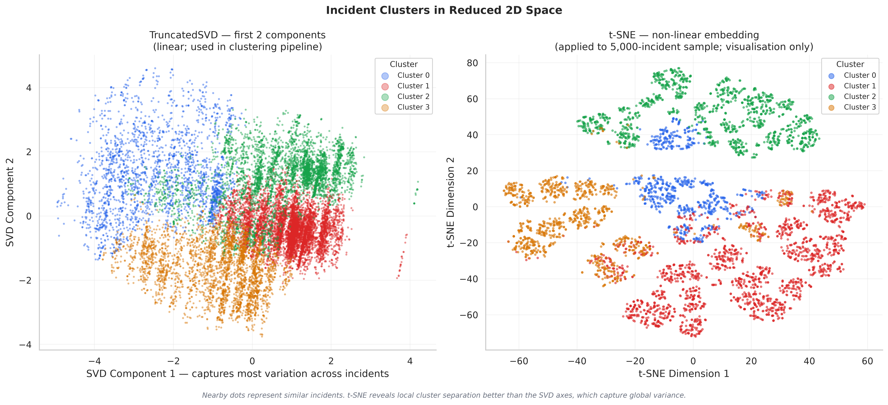
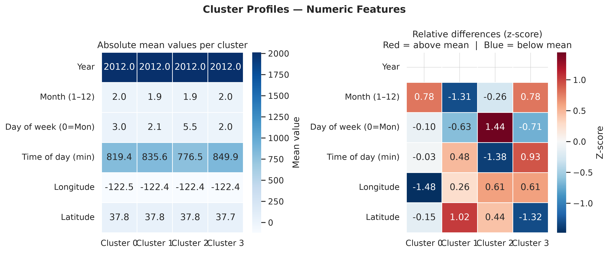
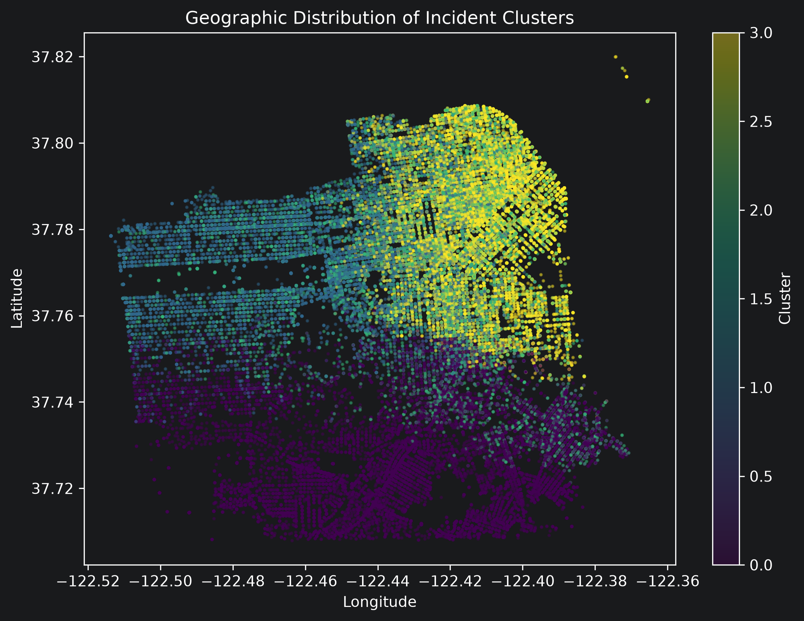
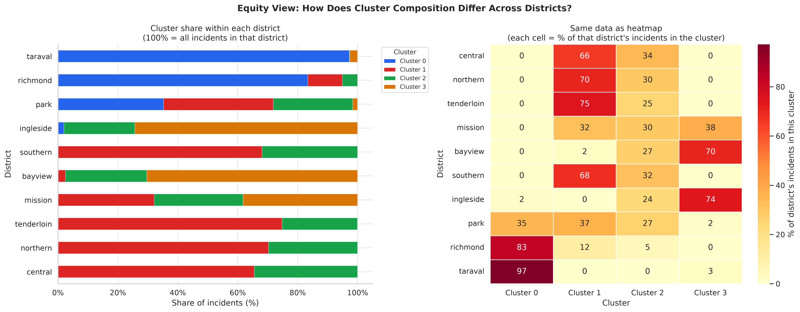

# Police Incidents Clustering

An unsupervised machine learning pipeline that isolates, compresses, and clusters
high-dimensional public safety logs from the Center for Policing Equity (CPE).
By combining **Truncated SVD** and **MiniBatch K-Means**, the pipeline identifies
four distinct operational signatures within ~315k incident records to help
municipal leaders understand policing patterns, optimize resource allocation, and
audit public safety equity across districts.

## Goal

Reduce the complexity of a large policing-incident dataset, identify homogeneous
groups of incidents, and produce visualizations and descriptive cluster summaries
that support equity-focused interpretation — even by non-technical stakeholders.

## Dataset

Data Science for Good (Kaggle):

https://www.kaggle.com/datasets/center-for-policing-equity/data-science-for-good

The analysis targets the high-fidelity incident report file under `Dept_49-00081`,
selected for its completeness and temporal coverage (2012 - mid-2015).

## Pipeline

### 1. Exploratory Data Analysis (`main.ipynb`)

Before any modeling, the raw data is explored to understand structure, assess
data quality, and form hypotheses about patterns clustering might reveal:

- Missing-value rates per column
- Top incident reasons and disposition distributions
- Temporal patterns (hour of day, day of week, monthly volume trend)
- Geographic scatter and per-district incident counts

### 2. Data Engineering & Feature Processing (`main.ipynb`)

- Dropped uninformative identifiers and high-cardinality street addresses to
  eliminate noise that would produce near-unique one-hot encodings.
- Preserved exact coordinate vectors (`LOCATION_LONGITUDE`, `LOCATION_LATITUDE`)
  plus coarsened geographic bins (0.01° ≈ 1 km) for neighbourhood-level signal.
- Extracted temporal features: year, month, day of week, continuous time in
  minutes, binary weekend flag, and a four-period time-of-day label
  (night / morning / afternoon / evening).
- Encoded categorical attributes (`INCIDENT_REASON`, `DISPOSITION`, `LOCATION_DISTRICT`)
  into memory-efficient sparse one-hot matrices.
- Applied median imputation for numerics and most-frequent imputation for
  categoricals; StandardScaler applied to numeric features to prevent coordinate
  magnitudes from dominating Euclidean distance calculations.

### 3. Dimensionality Reduction (`main.ipynb`)

Two techniques are evaluated, they serve different purposes and are not
interchangeable:

| Technique | Role | Why |
|-----------|------|-----|
| **TruncatedSVD** | Clustering pipeline | Operates on sparse matrices directly; produces a stable dense representation that K-Means can use; can transform new data |
| **t-SNE** | Visualisation only | Non-linear; reveals local cluster separation better than SVD's first two components; cannot transform unseen data; applied to a 5,000-record sample only |

TruncatedSVD projects the high-dimensional sparse feature space down to 50
continuous components, preserving the majority of structural variance while
bypassing the curse of dimensionality.

### 4. Clustering & Hyperparameter Selection (`main.ipynb`)

An iterative evaluation loop (k = 2 to 10) is run using three complementary
metrics:

- **Silhouette score:** how well-separated clusters are globally (higher = better)
- **Davies-Bouldin index:** ratio of within-cluster scatter to between-cluster
  distance (lower = better)
- **Inertia / Elbow:** total within-cluster sum of squares (look for the elbow)

**Why k = 4:**  
The silhouette score peaks at k = 3, but the Davies-Bouldin index reaches its
minimum at k = 4. When these two metrics disagree, it typically means that one
of the k = 3 clusters is internally heterogeneous, it contains two genuinely
different subgroups that k = 4 correctly separates. The Davies-Bouldin index
detects this internal scatter; silhouette does not, because it only compares a
point to its nearest *other* cluster rather than examining within-cluster
compactness. The elbow plot confirms that the inertia drop from k = 3 to k = 4
is still meaningful, while gains beyond k = 4 diminish sharply. k = 4 therefore
produces clusters that are both statistically compact and practically
interpretable.

## How to Run

Install dependencies:

```bash
pip install -r requirements.txt
```

Run the pipeline:

1. Clone the repository.
2. Download the CPE dataset from Kaggle and place the target CSV at the path
   configured in `main.ipynb` (`DATA_PATH`).
3. Optionally run `db_explore.ipynb` to review the source-file filtering logic
   and choose a different department file.
4. Run the full pipeline:

```bash
jupyter nbconvert --to notebook --execute main.ipynb --output main_executed.ipynb
```

Or open interactively:

```bash
jupyter notebook main.ipynb
```

> **Note:** `policing_equity_clustered.csv` and the raw dataset are not pushed
> to this repository due to file size. Both are generated locally when you run
> the notebook.

## Outputs

The pipeline writes all results to an `outputs/` folder:

```text
outputs/
├── column_summary.csv                    # Per-column dtype, missing rate, cardinality
├── feature_summary.csv                   # Same for model features after engineering
├── svd_explained_variance.csv            # Explained variance per SVD component
├── svd_components.csv                    # Full SVD-transformed dataset (50 dims)
├── svd_2d_coordinates.csv                # First 2 SVD dims + cluster label
├── tsne_2d_coordinates.csv               # t-SNE 2D embedding (sample) (not pushed)
├── cluster_evaluation.csv                # Silhouette, Davies-Bouldin, inertia for k=2…10
├── cluster_counts.csv                    # Incident count and share per cluster
├── numeric_cluster_summary.csv           # Mean/median/std of numeric features per cluster
├── final_cluster_summary_for_report.csv  # Full cluster profiles (top values, averages)
├── policing_equity_clustered.csv         # Full dataset with cluster column (not pushed)
└── figures/
```

## Key Visualisations

### Cluster selection

**`cluster_evaluation_combined.png:`** All three metrics in one panel with the
chosen k marked. The silhouette score peaks at k = 3; the Davies-Bouldin index
reaches its minimum at k = 4. The elbow confirms k = 4 as the point of
diminishing inertia returns.



---

### Dimensionality reduction comparison

**`dim_reduction_clusters_comparison.png:`** SVD and t-SNE projections of the
same incidents, colored by cluster. The t-SNE panel better reveals whether
clusters are genuinely separated; the SVD panel shows the linear axes used by
K-Means.



---

### Cluster profiles

**`cluster_profile_heatmap.png:`** Absolute mean values and z-score-normalized
relative differences across clusters for all numeric features. Time of day is
the strongest differentiator; geographic coordinates reveal spatial concentration.



---

### Geographic distribution

**`geographic_cluster_distribution.png:`** Spatial polarization of clusters:
traffic enforcement concentrated along highways vs. crisis management clustered
in dense urban centres.



---

### Equity analysis

**`equity_cluster_share_by_district.png:`** For each district, the share of
incidents belonging to each cluster. Divergent rows indicate districts that
experience a qualitatively different policing profile from the rest of the
community.



## Cluster Conclusions

| Cluster | Label | Description |
|---------|-------|-------------|
| **0** | Administrative & Low-Friction Controls | Routine premise checks and minor incidents resolved quickly via scene dismissals or verbal warnings |
| **1** | High-Severity Interventions | Serious criminal violations and warrant executions resulting primarily in formal arrests and physical bookings |
| **2** | Routine Regulatory & Traffic Enforcement | Highly transactional, vehicle-code-driven stops resolved almost exclusively via field citations or summonses |
| **3** | Crisis & Medical Case Management | Public health incidents (mental health crises, overdoses, welfare checks) requiring psychiatric holds and medical handoffs rather than criminal processing |

**Equity note:** The cluster composition varies across districts (see
`equity_cluster_share_by_district.png`). Districts where Cluster 1 or Cluster 3
is disproportionately concentrated relative to the city-wide average may warrant
further investigation. These findings are descriptive — causal conclusions
regarding racial or socioeconomic disparities require demographic data not
present in this dataset.

## License

[MIT License](LICENSE)

## Authors

[Anri 😎](https://github.com/anristepanian)
